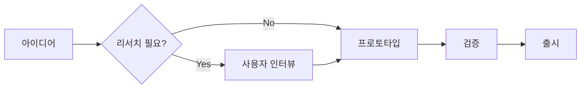

<!-- layout: title -->
# Visuals Demo
## Tables · Flow · Mermaid
design-deck · 2026-04-24

---

<!-- layout: content -->
<!-- chapter: "01 · Tables" -->
<!-- meta: "Markdown tables" -->

# 마크다운 테이블

| 기능 | 오프라인 | 복잡도 | 추천 용도 |
| --- | :---: | :---: | --- |
| `:::flow` | ✓ | 낮음 | 2–5 단계 선형 플로우 |
| Mermaid | 외부 CDN | 높음 | 분기·수렴·상태 머신 |
| Chart (donut/bar) | ✓ | 중간 | 비율·수치 비교 |
| Stats 카드 | ✓ | 낮음 | KPI 숫자 3–6개 |

머릿줄 밑줄은 오렌지, 본문 행은 은은한 구분선 + hover 강조.

---

<!-- layout: content -->
<!-- chapter: "02 · Flow" -->
<!-- meta: "Offline linear flow" -->

# 간단 플로우 (`:::flow`)

외부 라이브러리 없이 한 줄 = 한 단계. `|` 로 카드 안 서브 라인 추가.

:::flow
관찰 | Observe
학습 | Learn
실행 | Execute
측정 | Measure
:::

인쇄·오프라인 환경에서도 그대로 렌더됩니다.

---

<!-- layout: content -->
<!-- chapter: "03 · Mermaid" -->
<!-- meta: "Flowchart / Sequence / State" -->

# Mermaid — 분기·수렴이 필요한 다이어그램

뷰어가 인터넷에 연결되어 있을 때만 렌더. PDF 출력은 먼저 Chrome 에서 다이어그램이 그려진 뒤 `Cmd+P` 저장.

---

<!-- layout: closing -->
# Thank you
